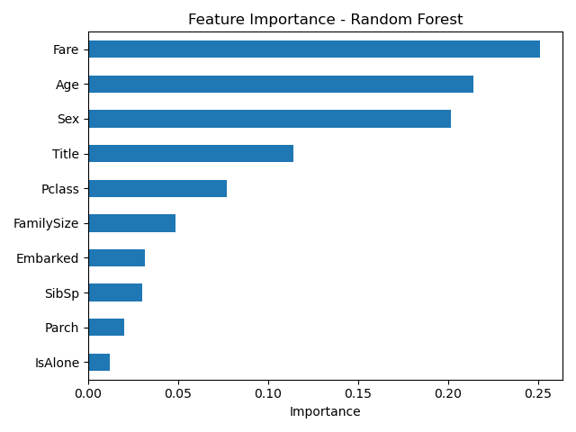

# Titanic Survival Prediction

## Problem Statement
Predict whether a passenger survived the Titanic disaster based on demographic 
and travel data, using supervised classification models.

## Dataset
Kaggle Titanic - Machine Learning from Disaster (train.csv, 891 passengers)

## Approach
1. Handled missing values (Age filled by Pclass+Sex group median, Embarked by mode, Cabin dropped)
2. Engineered new features: Title (from Name), FamilySize, IsAlone
3. Encoded categorical variables (Sex, Embarked, Title)
4. Trained and compared Logistic Regression and Random Forest classifiers

## Results
| Model | Accuracy | Precision | Recall |
|-------|----------|-----------|--------|
| Logistic Regression | 81.0% | 79.4% | 73.0% |
| **Random Forest** | **84.4%** | **81.1%** | **81.1%** |

Random Forest outperformed Logistic Regression across all metrics, likely due to 
its ability to capture non-linear relationships and feature interactions.

   ## Feature Importance
   

   
## Key Insight
[Fill in once you see feature importance — e.g., "Sex and Title were the strongest 
predictors of survival, consistent with the historical 'women and children first' 
policy."]

## Tools Used
Python, Pandas, NumPy, Scikit-learn, Matplotlib, Seaborn

## Future Improvements
- Hyperparameter tuning (GridSearchCV)
- Cross-validation for more robust evaluation
- Try additional models (XGBoost, SVM)
